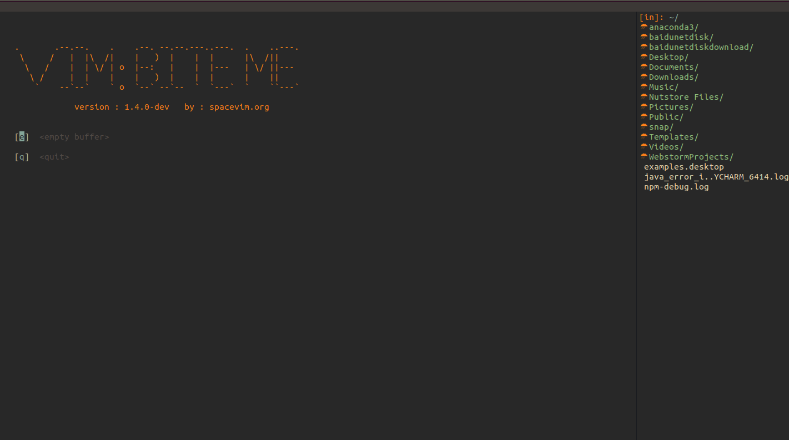

[top]

# SoftwareConfig

## Spacevim

**说明：**

- 安装脚本会删除原有的vim配置文件，如果您的设备以前安装过vim。请妥善保存vim的配置文件（~/.vimrc）
- 如果对spacevim不是很熟悉，可以参考[链接](https://spacevim.org/cn/quick-start-guide/)

```bash
#执行下面命令，会自动安装Spacevim及其相关依赖
wget -qO- https://raw.githubusercontent.com/youngsw/SoftwareConfig/master/SpaceVimSw.sh | sh -x

```

**展示：**

- 