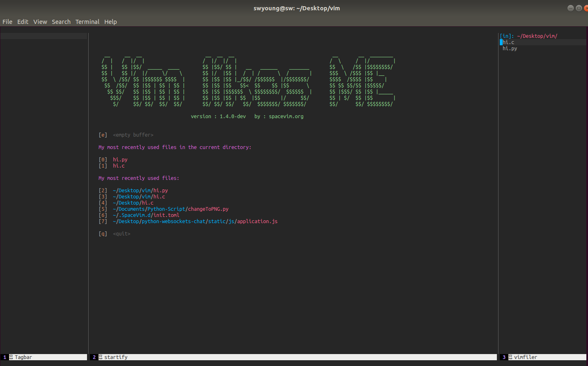

# SoftwareConfig

## Spacevim

**说明：**

- 安装脚本会删除原有的vim配置文件，如果您的设备以前安装过vim。请妥善保存vim的配置文件（~/.vimrc）
- 如果对spacevim不是很熟悉，可以参考[链接](https://spacevim.org/cn/quick-start-guide/)
- Spacevim的模块，配置文件可以参考[链接](https://spacevim.org/cn/layers/)

```bash
#执行下面命令，会自动安装Spacevim及其相关依赖
wget -qO- https://raw.githubusercontent.com/youngsw/SoftwareConfig/master/SpaceVimSw.sh | sh -x

```

**展示：**

- 

  

**注意：**

- 现已去除脚本中对init文件的替换。

```init.toml```文件位于```~/.SpaceVim.d/```中，具体配置可以参考 [官方模块配置链接](https://spacevim.org/cn/layers/) 和 [个人配置](https://raw.githubusercontent.com/youngsw/SoftwareConfig/master/init.toml)

- 正常情况下插件会自动安装，如果没有自动安装，可以```:SPUpdate```来更新插件


